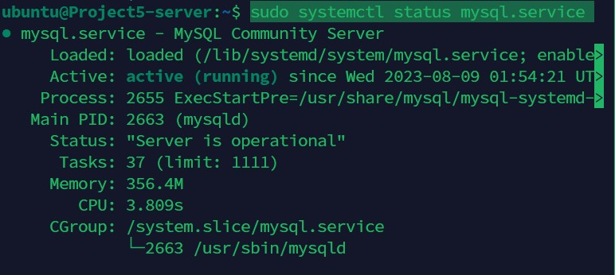
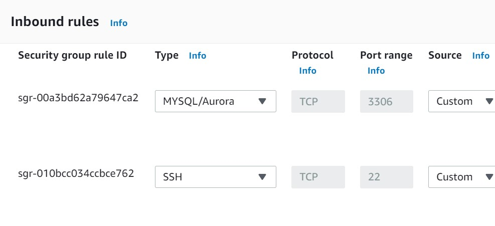

# Kingsley Documentation Of Project 5

In this Project, we are Implementing A Client Server Achitecture using MySQL Database Management System (DBMS)

## Step 1
Create and configure two Linux-based virtual servers (EC2 instances in AWS)

1. Server A Name: Project5-Client
2. Server B Name: Project5-Server

## Step 2

On Project5-Server Linux Server install MySQL Server software

`sudo apt update -y`

`sudo apt install mysql-server`

`sudo systemctl status mysql.service`

## Step 3

On Project5-Client Linux Server install MySQL Client software

`sudo apt update -y`

`sudo apt install mysql-client`

`which mysql`

## Step 4

Create a new entry in ‘Inbound rules’ in ‘Project5-server’ Security Groups. For extra security

Note: Allow access only to the specific local IP address of ‘Project5-client’

