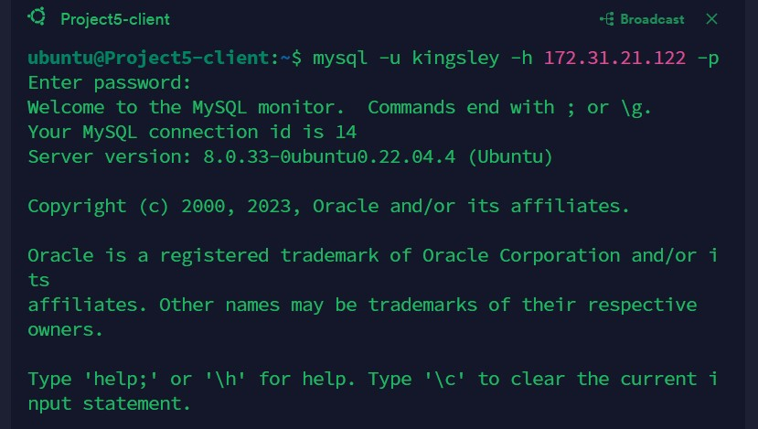
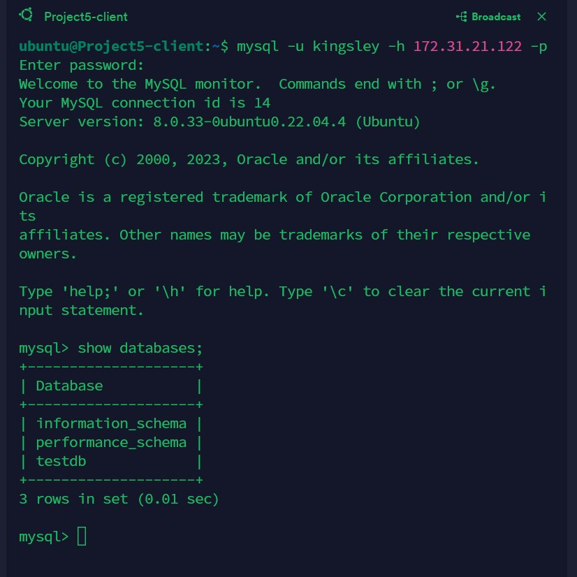

# Kingsley Documentation Of Project 5

In this Project, we are Implementing A Client Server Achitecture using MySQL Database Management System (DBMS)

## Step 1
Create and configure two Linux-based virtual servers (EC2 instances in AWS)

1. Server A Name: Project5-Client
2. Server B Name: Project5-Server

## Step 2

On Project5-Server Linux Server install MySQL Server software

`sudo apt update -y`

`sudo apt install mysql-server`

`sudo systemctl status mysql.service`

## Step 3

*On Project5-Client Linux Server install MySQL Client software*

`sudo apt update -y`

`sudo apt install mysql-client`

`which mysql`

## Step 4

*Create a new entry in ‘Inbound rules’ in ‘Project5-server’ Security Groups. For extra security*

Note: Allow access only to the specific local IP address of ‘Project5-client’

## Step 5

*Configure MySQL server to allow connections from remote hosts*

`sudo vi /etc/mysql/mysql.conf.d/mysqld.cnf`

Replace Bind Address ‘127.0.0.1’ with ‘0.0.0.0’

`sudo systemctl restart mysql.service`

## Step 6
*From Project5-client Linux Server i connected remotely to Project5-server Database Engine without using SSH. i use the mysql utility to perform this action*

`mysql -u kingsley -h 172.31.21.122 -p`

## Step 7

*Connect to a remote MySQL server and can perform SQL queries*

`show databases;`

